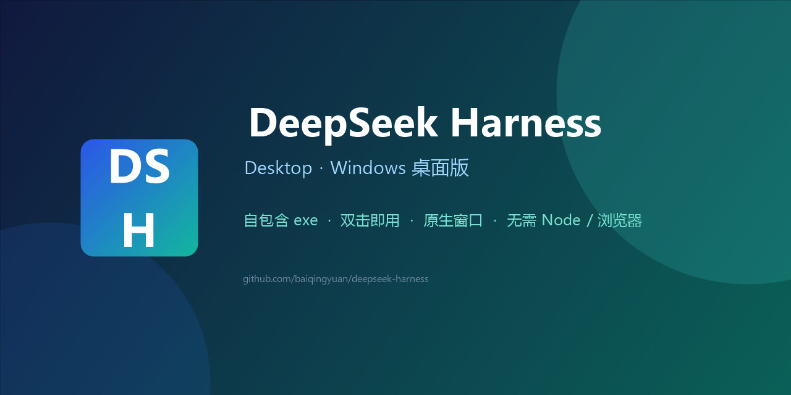

<p align="center">
  
</p>

<h1 align="center">DeepSeek Harness Desktop</h1>

<p align="center">
  <b>Windows 桌面版 DeepSeek Harness</b> —— 自包含 exe，双击即用，无需安装 Node / 浏览器 / 命令行。
</p>

<p align="center">
  <a href="https://github.com/baiqingyuan/deepseek-harness/releases"></a>
  <a href="https://github.com/baiqingyuan/deepseek-harness/releases"></a>
  
  <a href="LICENSE"></a>
</p>

> 底层是官方开源的 [DeepSeek Harness (dsh)](https://github.com/deepseek-ai/DeepSeek-Harness)（MIT），本项目为它提供一个原生 Windows 桌面壳（C# WinForms + WebView2）。

---

## ✨ 特性

- ✅ **真正独立的 exe**：原生窗口（无地址栏/标签页），基于 WebView2
- ✅ **自包含**：应用目录自带 `node.exe` + 全部 `node_modules`，整个文件夹可整体拷走
- ✅ **打开即用**：双击启动 → 自动拉起本地 dsh 服务 → 窗口加载界面（实测约 4 秒就绪）
- ✅ **关窗即停**：关闭窗口自动停止服务，不残留后台进程（也会接管并清理异常残留）
- ✅ **零配置**：Windows 10/11 自带 .NET Framework 与 WebView2 运行时，无需额外安装
- ✅ **自动修复依赖**：检测到 WebView2 运行时缺失时会弹窗引导一键下载并静默安装；node / dsh 文件被杀软误删或被占用端口时给出明确中文提示，不再黑话报错

## 📥 下载

从 [Releases 页面](https://github.com/baiqingyuan/deepseek-harness/releases) 下载最新版：

- `DeepSeekHarness-Desktop-vX.Y.Z-win-x64.zip`（便携版，约 110 MB）

## 🚀 使用

1. 下载并解压 zip（整个文件夹一起解压，不要只拖 exe 出来）
2. **一键安装**：双击 `install.bat`，自动在桌面与开始菜单创建 `DeepSeek Harness` 快捷方式（无需管理员权限）
   - 或直接双击 `DeepSeekHarness.exe` 立即运行（便携模式）
3. 首次打开在界面中配置你的 **DeepSeek API Key**
4. 关闭窗口即停止服务
5. 如需卸载：运行 `uninstall.bat` 删除快捷方式，再删除整个文件夹即可

**系统要求**：Windows 10/11 x64（内置 .NET Framework 4.8 与 WebView2 运行时）

## 🛠 从源码构建

```powershell
# 需要：Windows + PowerShell + Node.js（联网；pnpm 缺失时脚本会自动安装）
./build.ps1            # 产物在 dist\DeepSeekHarness\
./package-release.ps1  # 若 dist 不存在会自动先 build；压缩包在 dist\DeepSeekHarness-Desktop-vX.Y.Z-win-x64.zip
```

构建脚本会自动：获取 Node.js → 用 pnpm 安装 `@deepseek-ai/dsh`（扁平布局，无符号链接；pnpm 缺失时自动 `corepack` / `npm i -g pnpm`）→ 下载 WebView2 程序集 → 用系统 csc 编译 exe。

也可以直接用 GitHub Actions 一键发布（无需本机环境）：

- **推 `v*` tag**：自动构建并上传到 Release（见 `.github/workflows/release.yml`）。
- **手动触发**：在 Actions 页面选 `Build and Release` → `Run workflow`，填入版本号（如 `1.0.0`）即可，无需打 tag。

## 📁 目录结构

```
src/App.cs          桌面壳源码（C# WinForms + WebView2）
src/BUILD.md        手工编译说明
build.ps1           一键构建
package-release.ps1 打包 zip
assets/cover.png    仓库封面
icons/              应用图标
dist/               构建产物（不入库）
```

## ❓ 常见问题

**Q：为什么杀毒软件/SmartScreen 有提示？**
未签名的自包含 exe 首次运行可能触发 SmartScreen，点"更多信息 → 仍要运行"即可。长期使用可自行用代码签名证书签名。

**Q：需要装 Node.js 吗？**
不需要。发布包自带 `node.exe` 与全部依赖。

**Q：可以拷到别的电脑用吗？**
可以，整个 `DeepSeekHarness` 文件夹一起拷贝即可（保持 exe 与 node.exe/node_modules 同目录）。

**Q：WebView2 是什么？**
Windows 10/11 自带的 Edge 内核运行时；若系统精简版缺失，应用启动时会**自动弹出引导，一键下载并静默安装**，无需手动操作。也可从 [微软官网](https://developer.microsoft.com/microsoft-edge/webview2/) 手动安装。

## ⚠️ 免责声明

- 本项目为社区封装，与 DeepSeek 官方无隶属关系；底层 Harness 版权归 DeepSeek AI（MIT）。
- 使用需遵守 DeepSeek API 服务条款。
- 第三方组件（Node.js、WebView2、各 npm 包）的许可见 [THIRD_PARTY_NOTICES.md](THIRD_PARTY_NOTICES.md)。

## 📄 License

MIT，详见 [LICENSE](LICENSE)。

---

## English

**DeepSeek Harness Desktop** is a portable Windows app for [DeepSeek Harness (dsh)](https://github.com/deepseek-ai/DeepSeek-Harness): a standalone `DeepSeekHarness.exe` (C# WinForms + WebView2) that bundles its own Node.js runtime and dependencies.

- ✅ No Node.js / browser / CLI needed
- ✅ Double-click to run; the local dsh service auto-starts and stops with the window
- ✅ Portable folder — copy it anywhere on Windows 10/11 x64
- ⬇️ Download from [Releases](https://github.com/baiqingyuan/deepseek-harness/releases)

> This is a community wrapper, not affiliated with DeepSeek. The underlying Harness is MIT-licensed by DeepSeek AI.
